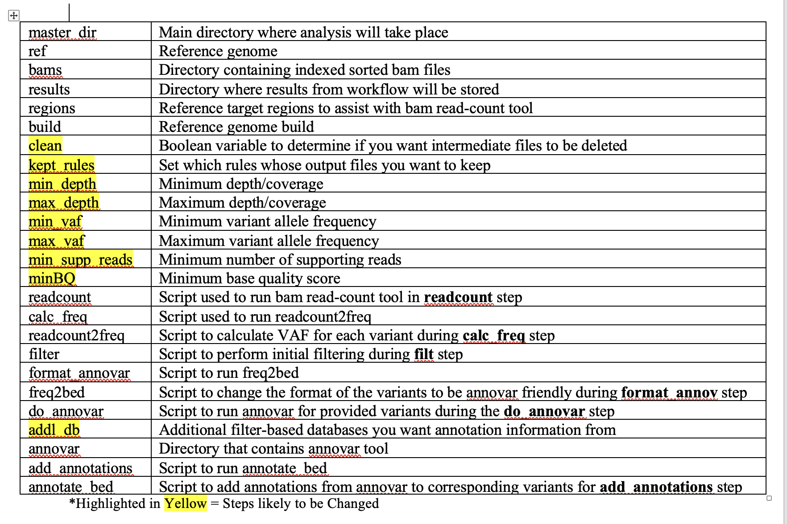
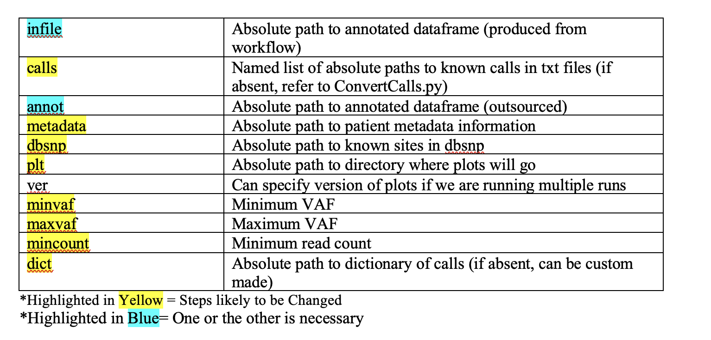
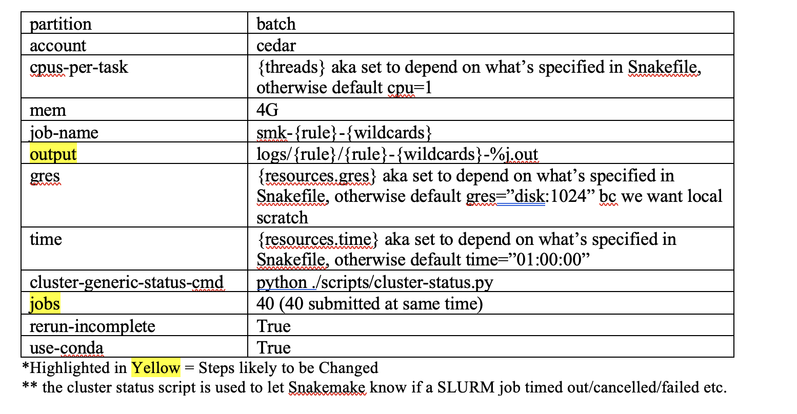

## Introduction
<details>
<summary><b>Overview </b></summary>
<br>
This repository consists of 2 components: 

1. Snakemake Workflow for Analyzing Sequencing Data and Mutation Calling 

2. Further Analysis of Mutation Calls via Comparison to Known Calls + Creating Companion Visualizations 

**NOTE:** Both components were originally developed for the use case of the HOP data. The 2nd component is less flexible for general use. I'd recommend only using the 1st for now for other data. 

<br>

**1. Workflow: Analyzing Sequencing Data and Mutation Calling**: 

    Input: Sorted bams w/ indexes
    1. Calculate read counts (bam-readcount)
    2. Calculate VAFs 
    3. Filter by minimum sequencind depth and minimum VAF
    4. Format calls into annovar-accepted format
    5. Annotate calls (annovar)
    6. Merge calls across libraries. 
    7. Additional filtering for nonsynonymous, minimum VAF, minimum sequencing depth, minimum # of supporting reads and minimum BQ 

  **NOTE:** If you want to know in detail how this workflow was created, click [here.](https://ohsuitg-my.sharepoint.com/:w:/r/personal/chaoe_ohsu_edu/Documents/Snakemake%20CHIP-HOP%20Workflow.docx?d=we5b5d1e4a231405c906d9cdc572f9541&csf=1&web=1&e=JN4NsA)


  If you do not have access to this document, please email Emily Chao (chaoe@arc.ohsu.edu). 

  I **HIGHLY** recommend using this document to guide you if you're a first time user. The instructions there are way more in-depth with thorough explanations. 

<br>

**2. Script: Further Analysis of Mutation Calls**: 

    Input: Dataframe of Annotated Calls
    1. Generates visualizations depending on given information: 
    - List of Known Calls (Provided via txt or custom created) 
    - Metadata of Patients (Age)

  An example of the visualizations that can be potentially created are here: 

```
/home/groups/CEDAR/chaoe/projects/HOP_test/figs/example
├── _AgeDistAcrossLibs.png
├── _CellCtsbyMeanDepth.png
├── _CtDistAcrossLibs.png
├── _MeanVafsbyMeanDepth.png
├── _MedianVagsbyMedianDepth.png
├── _ReadDistMin10.png
├── _ReadDistMin6.png
├── _ScatterVafsbyDepth_GeneColored.png
├── by_age
│   ├── _CallCts.png
│   ├── _CallCts2.png
│   ├── _CallCtsScatter.png
│   ├── _ChipPos.png
│   ├── _VafDist.png
│   ├── _VafDist2.png
│   ├── _Vafs.png
│   └── _VafsLog.png
├── by_gene
│   ├── _CallCts.png
│   ├── _CallCts_UniqueCallsCombined.png
│   ├── _MeanDepth.png
│   ├── _MedianDepth.png
│   ├── _NumUniqueVariants.png
│   ├── _VAFDist.png
│   └── _VAFDistLOG.png
└── by_lib
    ├── _Ages.png
    ├── _CallCts.png
    ├── _MeanDepth.png
    ├── _MedianDepth.png
    └── _VafDist.png
  ```

<br><br>
Both components were developed by Emily Chao, using Chris Boniface's scripts as the template. 
<br><br>

</details>

<details>
<summary><b>Getting Started</b></summary>
<br>

```bash 
srun --time=2:00:00 --mem=20G --partition=interactive --pty /usr/bin/bash -A [account]
cd /home/exacloud/gscratch/CEDAR/[user]

git clone https://github.com/ohsu-cedar-comp-hub/HOP_CHIP.git
cd HOP_CHIP

conda env create -f HOP.yaml 
conda activate HOP
```

Now, this is what your HOP_CHIP directory should look like: 

```


```

**NOTE:** For the Workflow, you will need to separately obtain annovar due to licensing restrictions. Obtain annovar [here.](https://annovar.openbioinformatics.org/en/latest/user-guide/download/)

</details>

## Running the Workflow 
<details>
<summary><b>From the Start</b></summary>
<br>

1. Input will be **sorted indexed bam files** (ending in *.sorted.bam and *.sorted.bam.bai). 

  - If you have your files handy, place them in their own directory labelled appropriately. 
  
  - If you have your files in Ceph, you will need to access them using your AWS profile. You will need to specify where you want your data to be stored and what your AWS profile is when running the launch script. Refer to Step 5 for more details. 

    <br>
    Want an example for the input? Look in the example directory. 
<br>

2. Edit **config/config_bams.json** accordingly and change paths as needed. 
The following are the variables you **must** change: 
- **master_dir:** absolute path to CHIP_HOP directory
- **bams:** absolute path to input data dir
- **results:** absolute path to desired results dir 

  There are many other variables you will likely want to adjust, please refer to [Config Breakdown For Workflow](#for-workflow) to see an in-depth overview of what each variable means. 

<br>

3. Edit **config/cluster/config.v8+.yaml** to change cluster configuration settings. 

    You can change the variables as needed. Most often, you may want to change where the output logs are going to, how the slurm jobs are named and number of jobs submitted at once. 

    If desired, you can also change the default resources. 
    You are also able to change the resource requests per rule in the smk file. More details in [another section]. 

    Refer to Cluster Config File Breakdown [Cluster Config File Breakdown](#cluster-config-file-breakdown) for more details. 

<br>

4. Perform a Snakemake dry run to confirm that your data will be ran correctly. 
    ```
    cd HOP_CHIP
    configfile=[absolute path to config_bams.json]
    snakefile=[absolute path to snakefile]

    snakemake -n --configfile=$configfile -s $snakefile 
    ```

    Pay close attention to the output of this dry run and check that the files Snakemake is expected to generate are correct. 

<br>

5. Now run this workflow using the launch script `run_pipeline.sh`. You will include the parameters `-d` and `-p` if you need to pull data from Ceph. 
    ```
    cd HOP_CHIP
    sbatch run_pipeline.sh -c $configfile -s $snakefile -d [dir you want data to be put in] -p [aws profile]

    ```

**NOTE:** If you want to run the workflow from the start, but end earlier, you would be looking to customize like this: 

```
cd HOP_CHIP

snakemake -n --configfile=$configfile -s $snakefile  --until [last rule to run]

sbatch run_pipeline.sh -c $configfile -s $snakefile -u [last rule to run]

```

</details>


<details>
<summary><b>Expected Outputs</b></summary>
<br>

All output files generated for each input will be located in the results folder indicated by config/config_bams.json. 

All outputs per sample wil be: 
 *.readcount, *.all_freq, *.metrics, *.#min_d_#percentmin_vaf.freq, *.freq.annovar_file, *.hg19_multianno.txt, *.annotated_readcounts

After merging: 
merged_final.csv, 
{rundate}/\_merged\_filt_nonsyn_{minvaf}
to{maxvaf} _ {#suppreads}supp_BQ{minBQ}

**NOTE:** The above only applies if you ran the workflow entirely from the beginning. 
  In addition, they only apply if you have specified **clean=false** in the config/config_bams.json. 

  If you had chosen to set **clean=true**, you can then specify the rules in **kept_rules** whose outputs you want to keep. This will be entirely based on what you need the workflow for. 


</details>

## Further Analyzing Mutation Calls 
<details>
<summary><b>Summary</b></summary>
<br>

This script can be used in 2 ways: 

1. Directly from Part 1 by using the resulting dataframe as input and then generating a new dataframe with added annotations from various sources (ex. known calls, dbsnp, metadata). 
<br>

2.  Using an already annotated dataframe and a dictionary containing the lists of known calls as inputs. 

<br>
The annotated dataframe will be used to create multiple visualizations specifically for mutation calls that match the provided known calls. 

<br>

**NOTE:** If you need to make a custom list of calls, refer to the section: Creating Custom Calls. 

**Files Involved:**
* {Today(YYMMMDD)}_merged_filt_nonsyn_{minvaf}to{maxvaf}percent_{minreads}supp_BQ{minBQ} (from Part 1 if Way 1)
* scripts/AnalyzeMutCalls.py 
* config/config_annot.json 

</details>

<details>
<summary><b>Running Script</b></summary>
<br>
1- Run AnalyzeMutCalls.py. 


```
usage: AnalyzeMutCalls.py [-h] [--infile INFILE] [--metadata METADATA] [--dbsnp DBSNP] [--annot ANNOT] [--plt PLT] [--ver VER] [--minvaf MINVAF] [--maxvaf MAXVAF]
                          [--mincount MINCOUNT] [--config CONFIG] [--calls KEY=VALUE [KEY=VALUE ...]] [--dict DICT]

options:
  -h, --help            show this help message and exit
  --infile INFILE, -i INFILE
                        Input File produced from Snakemake
  --metadata METADATA, -m METADATA
                        Patient metadata information
  --dbsnp DBSNP, -d DBSNP
                        Known sites in DBSNP
  --annot ANNOT, -a ANNOT
                        Annotated file
  --plt PLT, -p PLT     Directory where plots go
  --ver VER, -v VER     OPTIONAL Can specify version if multiple runs
  --minvaf MINVAF       OPTIONAL Minimum variant allele frequency
  --maxvaf MAXVAF       OPTIONAL Maximum variant allele frequency
  --mincount MINCOUNT   OPTIONAL Minimum read count
  --config CONFIG, -c CONFIG
                        OPTIONAL Path to JSON configuration file
  --calls KEY=VALUE [KEY=VALUE ...]
                        Set a number of key-value pairs where name = path to calls
  --dict DICT           Path to dictionary of calls

additional information: If you are starting with a file produced from Snakemake, --infile, --metadata, --calls, --dbsnp and --plt are required. Any that you don't
fill in will be filled in by default with config file. If you have an annotated file already, --annot, --dict and --plt are required.
```
If you are using the resulting file directly from Part 1 and you want to use your own paths to annotation files, an example would be:  

```bash 
python -u AnalyzeMutCalls.py -i {Today(YYMMMDD)}_merged_filt_nonsyn_{minvaf}to{maxvaf}percent_{minreads}supp_BQ{minBQ} -m HOP_first_500_metadata.csv -d dbsnp_22KD-115F0022-1_50X_intersect.bed -p /home/groups/CEDAR/chaoe/HOP_test/figs --calls watson=/home/groups/CEDAR/chaoe/HOP_test/calls/CHIP_sites_from_Watson_etal_Blundell_lab.txt beataml=/home/groups/CEDAR/chaoe/HOP_test/calls/CHIP_sites_from_BeatAML.txt
```

If you are using a previously annotated file and a corresponding dictionary, and just want the visualizations, an example could look like:  

```bash
python -u AnalyzeMutCalls.py -a HOP_merged_v1_240909.annotated_readcounts_crossref.csv --dict HOP_merged_v1_240909.callsdict.txt -p /home/groups/CEDAR/chaoe/HOP_test/figs
```

If your file is annotated, and you are missing the dict, you can create a .txt file and manually create one that maps each call list used in the file to the full name of the calls list. 
```
{'b':'beataml', 'c':'custom'}
```
**NOTE:** Because there are many parameters, you could also modify config_annot.json as an alternative to specifying parameters in the command line. You can refer here for the full breakdown of this config file. [Config Breakdown For Script](#for-further-analysis)

All visualizations generated will be in their respective matched calls' subdirectories in your given plot directory. 
An example of the visualizations you will see per subdirectory is in figs/example of this repo. 

</details>

<details>
<summary><b>Creating Custom Calls</b></summary>
<br>

Starting with a BED3 file, this script will convert your calls to a readable list so that it can be used above in AnalyzeMutCalls.py. 

Files Involved: 
* scripts/ConvertCalls.py 

1- Input file must be a BED3 file with format: 
```
chr start   end alt
```
2- Run ConvertCalls.py 
```
usage: ConvertCalls.py [-h] [--infile INFILE] [--annottool ANNOTTOOL] [--db DB] [--build BUILD] [--outdir OUTDIR]

options:
  -h, --help            show this help message and exit
  --infile INFILE, -i INFILE
                        Custom calls file in bed format
  --annottool ANNOTTOOL, -a ANNOTTOOL
                        Path to annovar perl script
  --db DB               Path to annovar human db
  --build BUILD         genome build
  --outdir OUTDIR, -o OUTDIR
                        Path to directory where reformatted calls goes

```
A usage example would be: 

```bash 
python -u ConvertCalls.py -i testcalls.freq.annovar_file -o /home/groups/CEDAR/chaoe/HOP_test/calls --annottool /home/groups/CEDAR/chaoe/HOP_test/tools/annovar/annotate_variation.pl --db /home/groups/CEDAR/chaoe/HOP_test/tools/annovar/humandb --build hg19

```

Resulting output is a *_reformatted.txt that will be in your specified output directory. 

This file can be added to the AnalyzeMutCalls.py as part of the --calls parameter. 

### Additional Notes 
You can enter in any number of list of calls for AnalyzeMutCalls.py. But, when using multiple list of calls, choose names that start with a different letter. The created annotation dataframe saves the first letter of the name if there is a match, so this will prevent any confusion. 
Good example: custom, beataml, watson . Bad example: custom, calls, california

</details>


## Config File Breakdown 

Use this breakdown to help determine which variables you would want to customize: 

### For Workflow



### For Further Analysis



## Cluster Config File Breakdown 

Use this breakdown to help determine which variables you would want to customize: 

